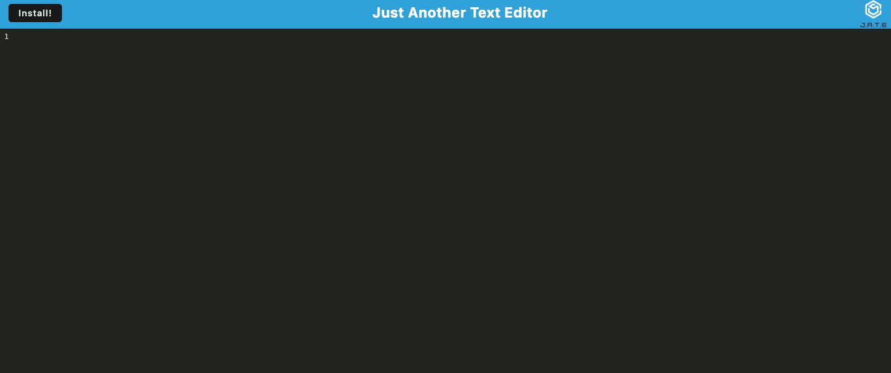

# Text-Editor




## Description

This is an application that serves a text-editor, offline and online. Deployed on Heroku 

## Table of Contents

- [Technologies Used](#technologies-used)
- [Code Snippets](#code-snippets)
- [Author](#author)


### Technologies Used
Please click on each link for installation

[Heroku](https://www.heroku.com)

[Node](https://nodejs.org/en/download/)

[Express](https://expressjs.com/en/starter/installing.html)

[Nodemon](https://www.npmjs.com/package/nodemon)

[Webpack](https://webpack.js.org/guides/getting-started/)


### Code Snippets

Below is a code snippet add logic to a method that accepts some content and adds it to the database
```

export const putDb = async (content) => {
  const jateDB = await openDB('jate', 1);
  const tx = jateDB.transaction('jate', 'readwrite');
  const store = tx.objectStore('jate');
  const request = store.put({id: 1, value: content});
  const result = await request;
  console.log('Data saved to database', result);
};
```


### Author

If you have any questions about the repository, open an issue or contact me directly at senaygebrat@gmail.com. You can find more of my work at [my Github](https://github.com/senaygebrat?tab=repositories), and further contact information at [LinkedIn](https://linkedin.com/in/senayg).